# Procesverslag
Markdown is een simpele manier om HTML te schrijven.  
Markdown cheat cheet: [Hulp bij het schrijven van Markdown](https://github.com/adam-p/markdown-here/wiki/Markdown-Cheatsheet).

Nb. De standaardstructuur en de spartaanse opmaak van de README.md zijn helemaal prima. Het gaat om de inhoud van je procesverslag. Besteedt de tijd voor pracht en praal aan je website.

Nb. Door *open* toe te voegen aan een *details* element kun je deze standaard open zetten. Fijn om dat steeds voor de relevante stuk(ken) te doen.

## Jij

  
uitwerken voor kick-off werkgroep

  ### Auteur:
  Ufuk Argun

  #### Je startniveau:
  Zwart

  #### Je focus:
  Responsive
 

## Je website

  
uitwerken voor kick-off werkgroep

  ### Je opdracht:
  https://mario.nintendo.com/

  #### Screenshot(s) van de eerste pagina (small screen): 
  Homepage  
  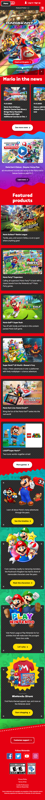

  #### Screenshot(s) van de tweede pagina (small screen):
  History of Mario  
  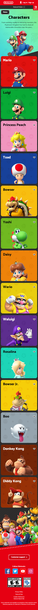
 

## Toegankelijkheidstest 1/2 (week 1)

  
uitwerken na test in 1e werkgroep

  ### Bevindingen
  Lijst met je bevindingen die in de test naar voren kwamen:

  #### Screenreader
  De screenreader is zeker iets waar iemand gewend aan moet raken,
  mijn bevindingen voor de screenreader zijn vooral dat de titels van de secties op kopniveau 2 zijn.
  De website is goed gestructureerd maar mist wel hidden titels waardoor een heel categorie wordt overgeslagen
  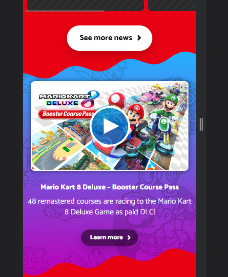
  Dit stuk wordt overgeslagen

  Dit kan opgelost worden door een hidden h2 toe te voegen bij deze sectie, dan leest de screenreader hem wel maar ziet de gebruiker hem niet.

  #### Muis en Toetsenbord 
  Er wordt gebruik gemaakt van states, zo worden de hover, focused, en pressed gestyled waardoor de gebruiker goede feedback krijgt waar hij zich bevindt.
  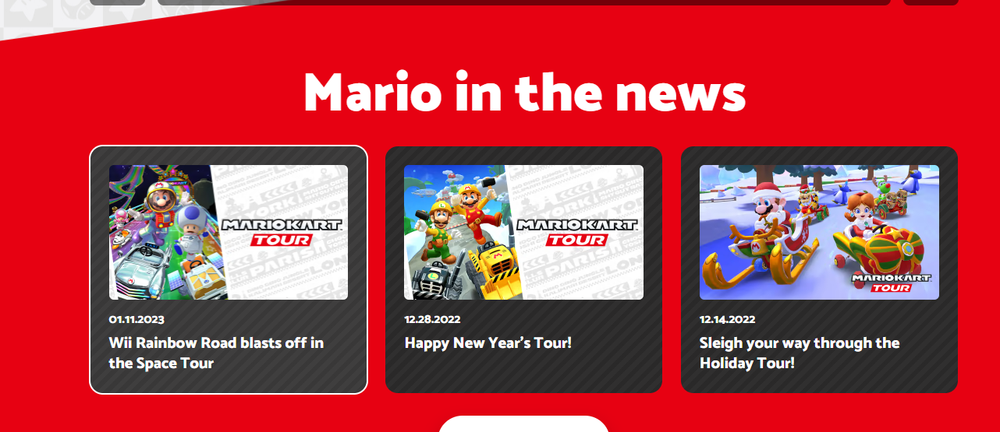
  De buttons zijn wel wat slechter gestyled naar mijn mening, er is te weinig verschil tussen de normal en hover state, het pijltje wordt alleen een klein stukje groter op de knop.
  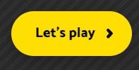
  Dit kan gefixt worden door de hover states van buttons wat duidelijker te maken door wat meer contrast verschil te tonen.

  Voor de toetsenbord zijn de focus states wel goed gestyled, deze hebben 2 borders, eerst een zwarte en dan een gele om het goed duidelijk te maken waar je bent getabbed.
  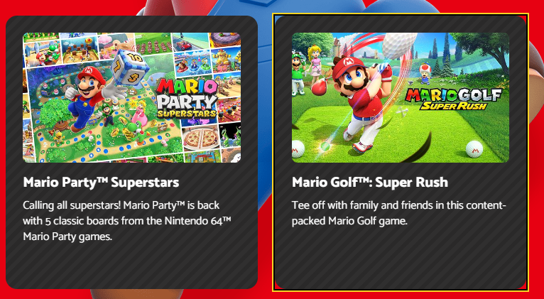

  #### Motoriek (shocks, elastiekjes)
  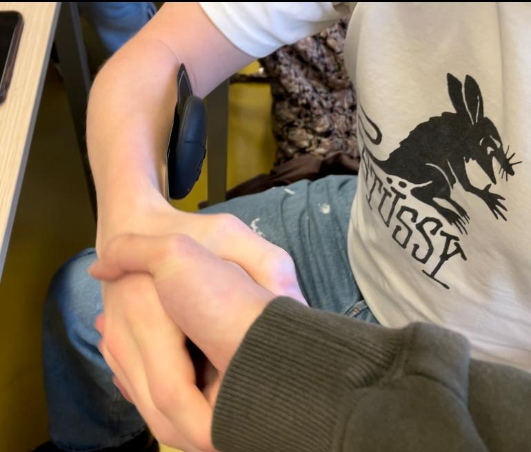
  De Mario Nintendo site lijkt goed geoptimaliseerd te zijn, de plaatjes zijn groot, de knoppen zijn groot, en er lijkt rekening gehouden te zijn met motorische storingen doordat bijna alles toegankelijk gemaakt is.

  #### Visueel (brillen, contrast, kleurenblind, dark/light). 
  De contrast op de site lijkt nog vrij goed te zijn, op de header na, de nintendo logo en sign up text vallen weg doordat ze zo klein in een hoekje zijn gepropt.
  We kunnen deze verbeteren door een andere header kleur te geven met goed contrast.
  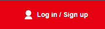

  De site heeft geen dark/light mode, maar wel een reduce motion optie.

## Breakdownschets (week 1)

  
uitwerken na afloop 2e werkgroep

  ### de hele pagina: 
  
  U kunt de foto zelf vinden in de readme-images voor als u gedetailleerd het wilt bekijken.

  ### dynamisch deel (bijv menu): 
  
  U kunt de foto zelf vinden in de readme-images voor als u gedetailleerd het wilt bekijken.

## Voortgang 1 (week 2)

  
uitwerken voor 1e voortgang

  ### Stand van zaken
  hier dit ging goed & dit was lastig (neem ook screenshots op van delen van je website en code)
  Het inschatten welke manieren ik moest gebruiken om dezelfde resultaat te behalen was goed, zo is mario op de hero, 3 plaatjes die achter elkaar zijn gestackt, ik heb dit kunnen namaken door position:absolute; te gebruiken.
  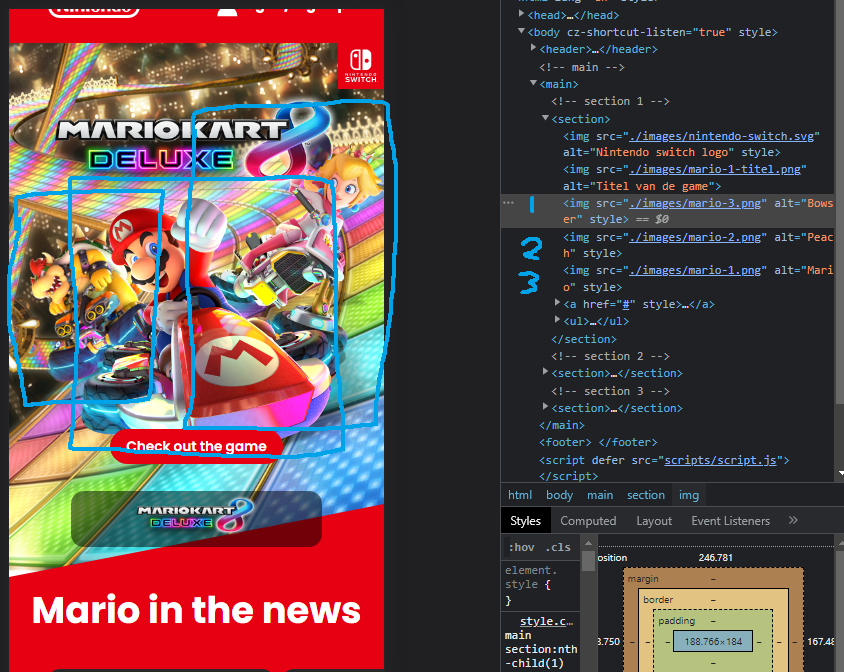

  Wat minder goed ging zijn die separation dividers, ze waren moeilijk om goed te plaatsen en geven mij nog vraagtekens voor hoe ik ze responsive zou moeten maken. Ik had problemen om de "Mario in the news" kop voor de divider te krijgen, na een tijdje zoeken op google kwam ik er achter dat ik nooit een position had gegeven en daardoor de z-index het maar niet bleef doen
  

  Wat ook minder goed ging was de Title selector die de originele site functionerend heeft gekregen, ik had hier veel tijd aan besteed totdat ik mij besefte dat een ul li gebruikt moest worden.
  Ik had een beginnetje daar aan gemaakt maar heb het tijdelijk als comment staan zodat het voor dit gesprek er nog goed uit ziet.
  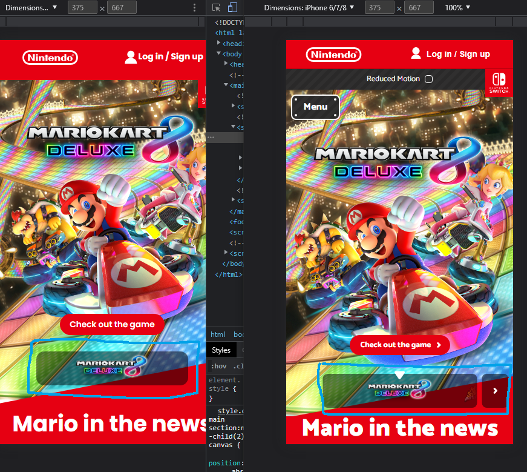

  ### Agenda voor meeting
  samen met je groepje opstellen

  | student 1      | student 2          | student 3          | 
  | Rouicha        | Beau               | Ufuk               |
  | dit bespreken  | en dit             | Feedback vragen    | 
  | en dat ook nog | dit als er tijd is | Bespreken wat de   | 
  | ...            | ...                | juiste keuzes zijn |               

  ### Verslag van meeting
  hier na afloop snel de uitkomsten van de meeting vastleggen

  - geen px meer gebruiken
  - rounded corners met em
  - title selector met target
  - media query goed gebruiken voor de separators, deze moeten goed er in staan

## Voortgang 2 (week 3)

  
uitwerken voor 2e voortgang

  ### Stand van zaken
  hier dit ging goed & dit was lastig (neem ook screenshots op van delen van je website en code)
  Wat goed ging was het plaatsen van de content in de html, omdat alle content eigenlijk van de site was te verkrijgen
  ik heb paar GIF's moeten omzetten naar een jpg, met een converter addon wat veel tijd in beslag nam uiteindelijk.

  ### Verslag van meeting
  hier na afloop snel de uitkomsten van de meeting vastleggen

  - nth-ofchild > nth tf type
  - canvas > divs
  - selector niet in js doen maar proberen in css met target selector
  - geen p in een a
  - hoofd item relatief maken

## Toegankelijkheidstest 2/2 (week 4)

  
uitwerken na test in 8e werkgroep

  Dit gaat hand in hand met de feedback van het eindgesprek

  ### Bevindingen
  De site was niet goed te gebruiken met de screenreader, verder was het vrij toegankelijk op de buttons voor motorische storingen na.
  Deze zijn verbeterd door de HTML te veranderen, dan heb ik het over h1-h3's, dit geeft de screenreader meer overzicht en structuur om te site te beluisteren.
  Voor de buttons zijn extra verticale paddings toegevoegd.
  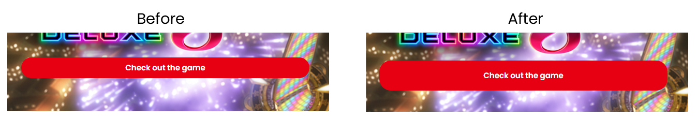

  #### Screenreader
  Secties worden overgeslagen doordat er geen hidden title is, hierdoor is de site niet goed toegankelijk voor de screenreader.
  Dit valt te fixen door visibility:hidden; toe te voegen aan een title.

  #### Muis en Toetsenbord 
  De knoppen zijn groot en vallen goed op, de tab functie werkt ook zoals gewenst en werkt chronologisch.

  #### Motoriek (shocks, elastiekjes)
  Sommige buttons zijn te kort verticaal waardoor als de gebruiker parkinsons heeft het soms nog moeilijk is om deze knop te klikken.
  Dit valt te fixen door meer vertical padding toe te voegen.

  #### Visueel (brillen, contrast, kleurenblind, dark/light). 
  Bijna alle elementen zijn interactief en veranderen of van kleur of grootte, hierdoor is het wat duidelijker waar de gebruiker zich bevindt.
  Voor slechtzienden was de header (nintendo logo en log in) nogsteeds in slechte contrast (vel rood op wit), deze heb ik aangepast naar een wat donkerdere tint.
  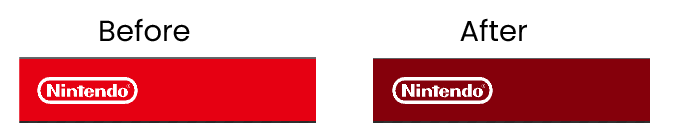

## Voortgang 3 (week 4)

  
uitwerken voor 3e voortgang

  ### Stand van zaken
  Hier ben ik bezig met de responsiveness, de title selector lijkt me nog niet te lukken.
  Ik ben vooral veel tijd kwijt aan de div seperators, deze moeten allemaal opnieuw een hoek aangewezen krijgen,
  maar er zijn momenten dat de divs net niet werken zoals we willen.
  Ik ben alvast aan het bedenken hoe ik iets met een laser kan toevoegen voor een extra punt.
  
  Deze voortgangsgesprek kon ik er niet bij zijn, daarom telt het eindgesprek eigenlijk als een voortgangsgesprek en krijg ik ook nog een reflectie om op te reflecteren.
  Zie het kopje reflectie.

## Eindgesprek (week 5)

  
uitwerken voor eindgesprek

  ### Je uitkomst - karakteristiek screenshots:
  
  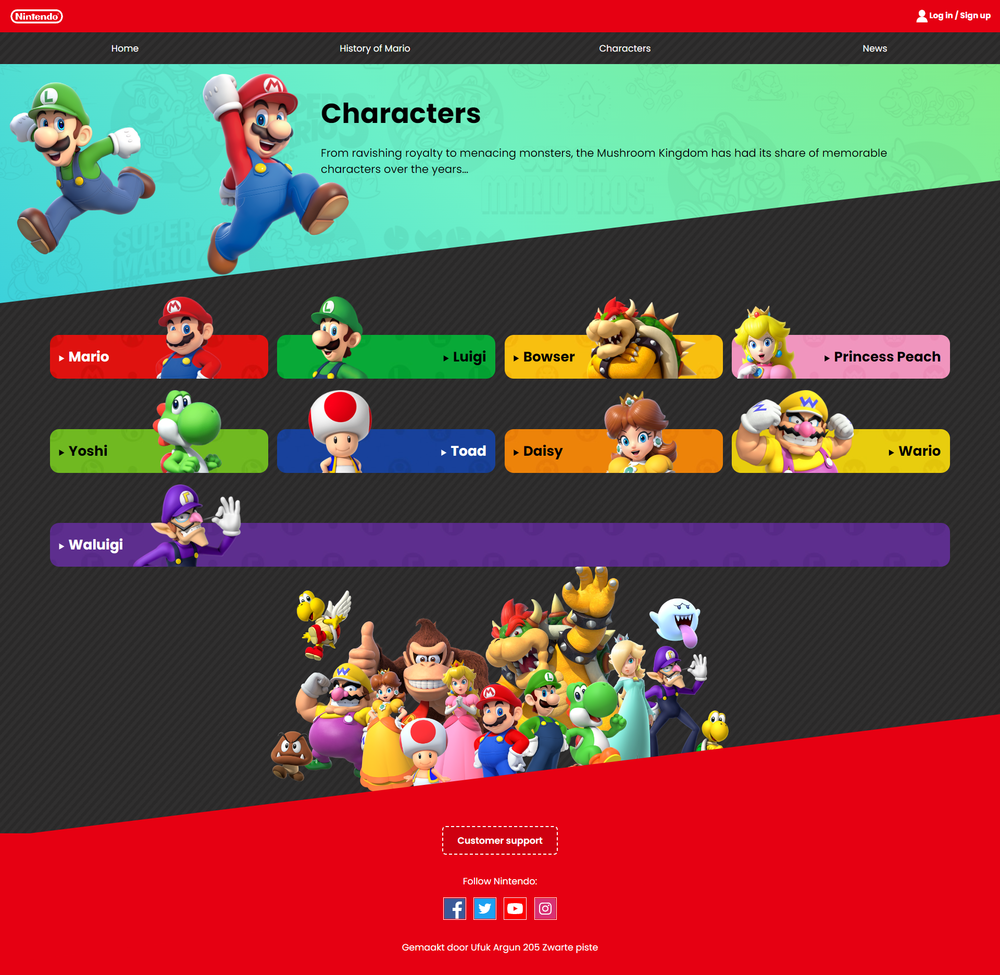

  ### Dit ging goed/Heb ik geleerd: 
  Korte omschrijving met plaatjes
  De nieuwe manieren die css nu aanbied, vroeger werkte ik namelijk alleen met bootstrap,
  maar omdat ik flexbox heb geleerd is het zeker bruikbaar in de toekomst
    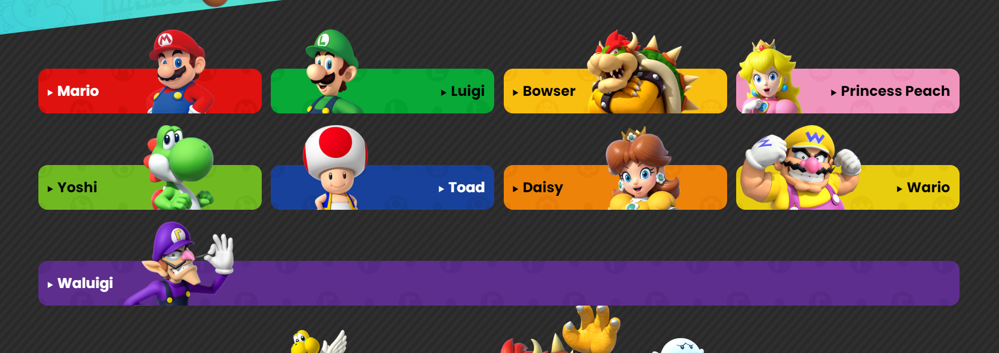
    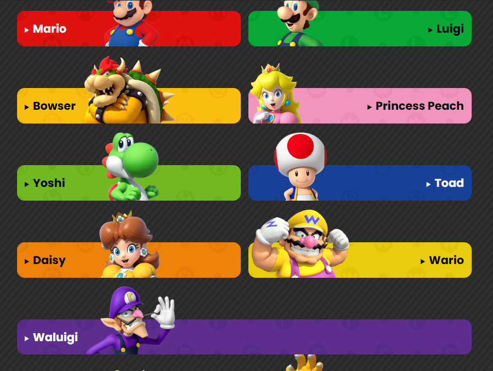
    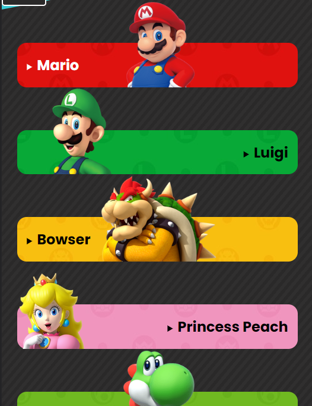

  ### Dit was lastig/Is niet gelukt:
  Korte omschrijving met plaatjes
  De title selector was vrij moeilijk doordat ik geen js hiervoor mocht gebruiken, ik had met de docent besproken hoe de logica hoorde te zijn,
  maar na uren lang op google en stackoverflow kijken gaf ik het op, dit heeft ook een groot deel van mijn tijd ingenomen.

  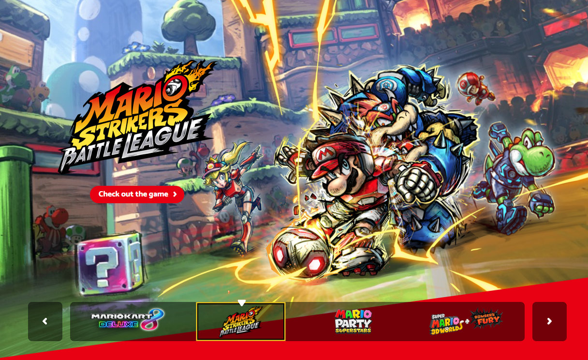

## Reflectie

  
Reflectie van de docent

  ### Feedback:
  - Kijk nog even kritisch naar je HTML :done
  - Doe een toegankelijkheidstest en reflecteer daar op :done
  - Reflecteer op de beoordeling en op je laatste iteratie :done
  - ga daarna pas verder met eventuele lasers enzo (-:

  ### Opgeschreven feedback tijdens het eindgesprek
  - html goed voor een screenreader maken :done
  - login een a maken :done
  - nintendo een h1 maken :done
  - betere h1-h3 gebruik :done
  - featured products, items een h3 maken :done
  - en dan featured products zelf een h2 :done
  - onzichtbare h2 voor de 3e sectie :done
  - toegankelijkheid testen :done
  - deze feedback verwerken en de readme afmaken :done
  - if's toevoegen aan JS zodat je geen error krijgt :done
  - als laatste lasers, dit is dezelfde logica als de nav menu

  In het algemeen heb ik de screenreader toegankelijkheid als main focus gebruikt, door simpelweg een h2 ergens toe te voegen verplaatste veel elementen.
  Dus: semantisch correcte volgorde, goed gebruik gemaakt van h1-h2-h3's, de positionering opnieuw wijzigen hierdoor, onzichtbare titels, betere focus styling, beter contrast voor mensen met visuele beperkingen, time functie goed gebruikt, h3 gegeven aan items titels voor een betere screenread ervaring.

  

## Bronnenlijst

  
continu bijhouden terwijl je werkt

  Nb. Wees specifiek ('css-tricks' als bron is bijv. niet specifiek genoeg).

  1. https://wweb.dev/resources/css-separator-generator/ voor het maken van de separators tussen sections
  2. Flexbox oefening som 13 voor het maken van de cards die van het beeld afgaan in section 2
  3. https://mario.nintendo.com/ voor het gebruiken van de images en kleurcodes kopieren
  4. Alle huiswerk opdrachten, hiervan heb ik veel in mijn code verwerkt
  5. https://stackoverflow.com/questions/67611426/css-transition-not-working-with-css-animation Voor het fixen van mijn animatie die maar niet werkte
  6. https://codepen.io/AKGD/pen/yvwQYZ voor ideeën van animaties
  7. https://codepen.io/erikterwan/pen/EVzeRP?editors=1100 De hammburger menu, ik heb de logica hiervan toegepast in mijn eigen ontwerp
  8. Samen met het huiswerk & https://www.geeksforgeeks.org/css-target-selector/ heb ik de selectors leren stylen
  9. het leren van de selectors gebruiken https://css-tricks.com/the-difference-between-nth-child-and-nth-of-type/
  10. vuurbal van https://art.pixilart.com/e8f2d3333f33d54.gif
  11. mario van https://mario.wiki.gallery/images/thumb/e/e3/NSMBUDXFireMario.png/1200px-NSMBUDXFireMario.png
  

